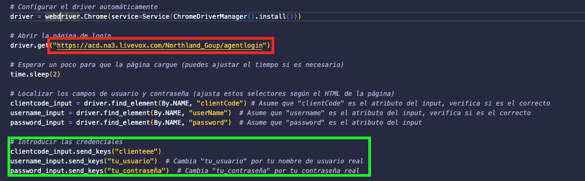

# scrapping-werb-work

### Como se ejecuta el programa?
Se debe tener instalado python si no se tiene seguir esta guia:

[Instalar python](https://kinsta.com/es/base-de-conocimiento/instalar-python/).

Despues de que python este instalado en el sistema ejecutar desde una consola de comandos lo siguiente:

`pip install -r requirements.txt`

Con todo esto estamos listos para ejecutar el programa, tan solo recuerda cambiar la url de la pagina en la cual estas trabajando.

Iremos al archivo scrap.py y cambiaremos el dato señalado de rojo y cambiaremos a la url que trabajaremos.

De igual manera los datos de inicio de sesion, los cuales se especifican en verde.

El programa trabajara por una hora antes de apagarse, asi podras evitar bloqueos.